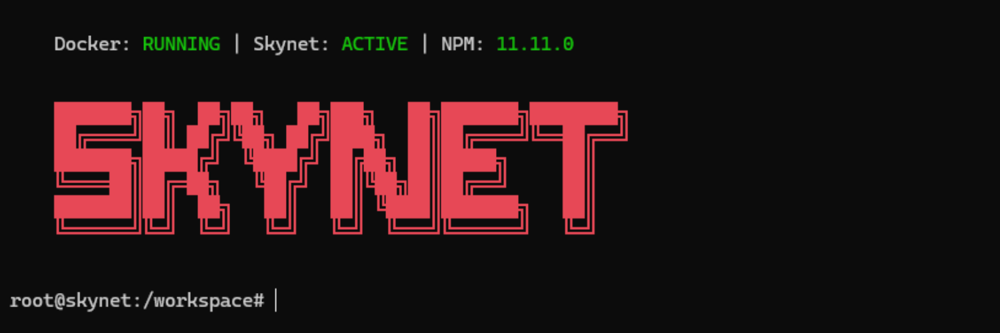

# Skynet Factory
- Lightweight development environment.
- Containerized workspace for AI CLI tools (Gemini, OpenCode)

## Bind Mounts

The container uses bind mounts to sync your local workspace with the container filesystem:

- **Host Path**: Defined by `WORKSPACE_SOURCE` in `.env` (e.g., `X:/skynet/workspace`)
- **Container Path**: Defined by `WORKSPACE_TARGET` in `.env` (default: `/workspace`)

All files in your source directory are accessible inside the container at the target path, allowing seamless development with persistent data.

## ENV sample

Create a `.env` file from `.env.sample`:

```env
UPDATE_APT=true
UPDATE_NPM=true
DISPLAY_BANNER=false
WORKSPACE_SOURCE=./workspace
WORKSPACE_TARGET=/workspace
INSTALL_CLAUDE=false
INSTALL_CODEX=false
INSTALL_GEMINI=false
INSTALL_OPENCODE=false
```

- `UPDATE_APT`: Update and upgrade apt on build
- `UPDATE_NPM`: Update npm to latest version on build
- `DISPLAY_BANNER`: Purely cosmetic display of ASCII banner on `clear`
- `WORKSPACE_SOURCE`: Local directory to mount
- `WORKSPACE_TARGET`: Mount point inside container
- `INSTALL_CLAUDE`: Install Anthropic Claude Code CLI tool
- `INSTALL_CODEX`: Install OpenAI Codex CLI tool
- `INSTALL_GEMINI`: Install Google Gemini CLI tool
- `INSTALL_OPENCODE`: Install OpenCode AI CLI tool

## Usage

Start the container using Docker Compose:

```bash
docker-compose up -d
```

Access the running container using the `skynet.bat` or `skynet.sh`.

```bash
skynet.bat
```
```bash
./skynet.sh
```


The script will:
- Check Docker daemon status
- Verify Skynet container is running
- Display npm version
- Launch an interactive bash session

Stop the container:

```bash
docker-compose down
```
